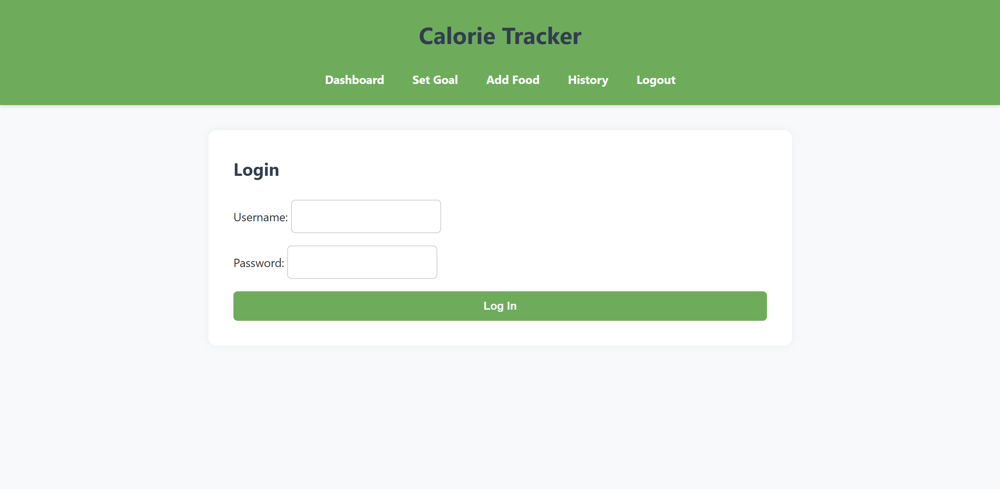
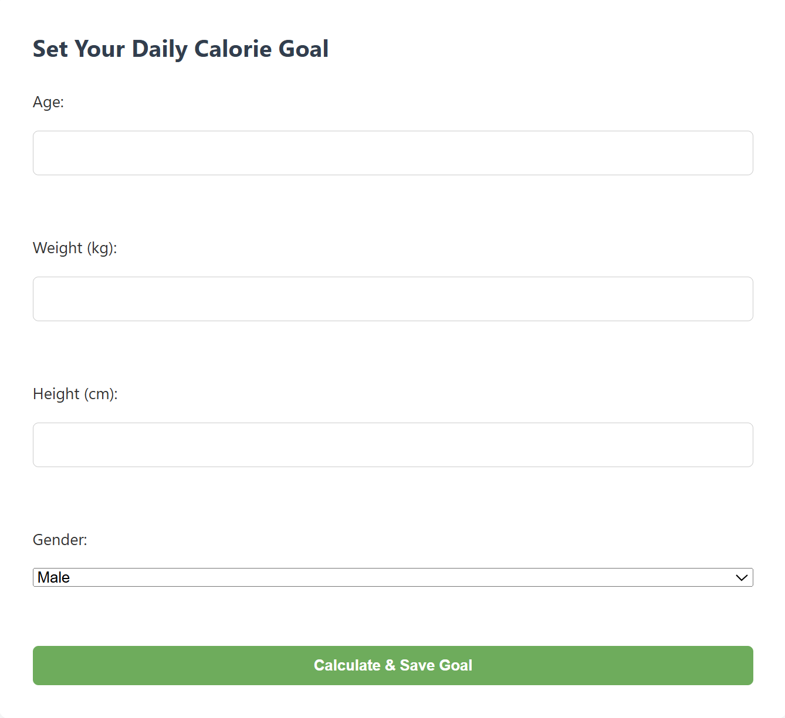
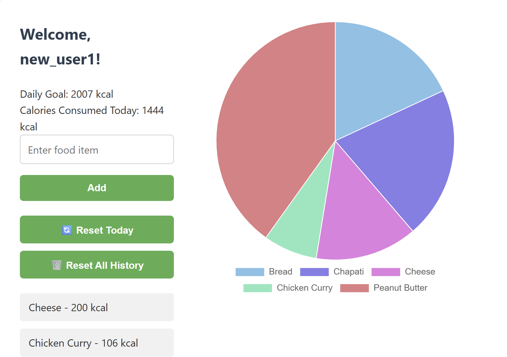

# 🥗 Calorie Tracker Web App

A full-stack Django web application that helps users track their daily calorie intake, set personalized goals, and receive feedback in a fun and engaging way.

## 🚀 Live Demo
👉 [Try it here](https://calorie-tracker-cy6p.onrender.com)

---

## 📸 Screenshots






---

## 🔑 Features

- 🔐 **User Authentication**: Register, login, and manage your own calorie logs securely.
- 🍎 **Search Food Calories**: Uses the [CalorieNinjas API](https://calorieninjas.com/) to fetch nutritional data.
- 📝 **Manual Entry**: Add custom foods not found in the API.
- 📊 **Calorie Visualization**: Daily progress bar and food breakdown chart.
- 🎯 **Goal Setting**: Personalized calorie caps based on age and weight.
- 🤣 **Motivational Alerts**: Fun messages when users reach or exceed their daily goal.
- 🔄 **Reset & History**: Clear logs and track new days with ease.

---

## 🛠️ Tech Stack

| Layer         | Tools Used                          |
|---------------|-------------------------------------|
| Backend       | Django, Django ORM                  |
| Frontend      | HTML, CSS, Bootstrap                |
| API           | CalorieNinjas API                   |
| Deployment    | Render / Railway (Gunicorn + PostgreSQL) |
| Database      | SQLite (dev), PostgreSQL (prod)     |

---

## 👨‍💻 Skills Demonstrated

- ✅ Django web development and REST integration
- ✅ Database modeling and ORM relationships
- ✅ User authentication & session management
- ✅ API integration (external and internal)
- ✅ State management across requests
- ✅ Deployment and production server configuration (Gunicorn, Whitenoise)
- ✅ Clean, responsive UI design
- ✅ Version control with Git & GitHub

---

## ⚙️ Setup Instructions

```bash
# Clone the repo
git clone https://github.com/your-username/calorie-tracker.git
cd calorie-tracker

# Install dependencies
pip install -r requirements.txt

# Run migrations
python manage.py migrate

# Start the server
python manage.py runserver
